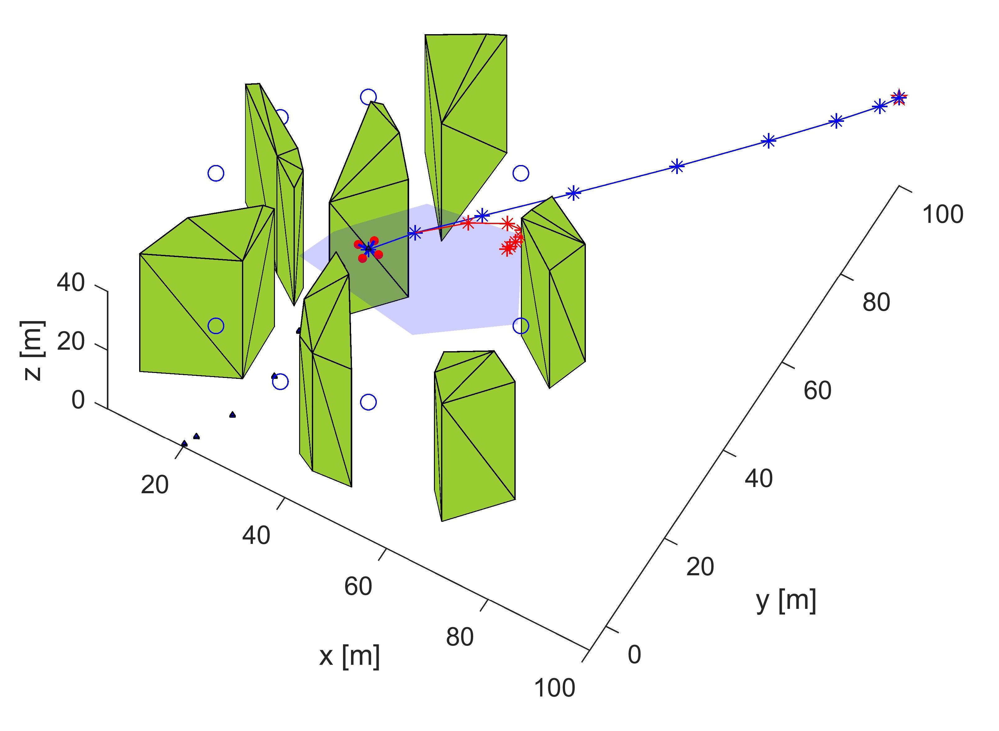

# mt-MPC (multi-trajectory Model Predictive Control) ROS packages

This repository contains the ROS packages developed and used for simulation and experimental tests of mt-MPC controller.
The control algorithm is described in the article **insert article here**.

## Test videos

### mt-MPC experimental Tests, ROS + Octocopter Drone

### mt-MPCsimulation on MatLab/Simulink

## Scheme of the packages

This scheme represents the interactions between the packages:
Package `s1000_interface` is used to interact with the lower level controller of the drone (a DJI S1000, controlled with a DJI A3 board) and the LiDAR sensor.
Package `gbeam_controller` is where the control algorithm is actually implemented.
Package `gbeam_ground` contains the nodes that allow the visualization of the data from the other packages, it reads the topics with custom messages, and writes on topics with standard messages to be shown in `rviz`.
Package `gbeam_library` contains message definitions and functions used by the other packages.
